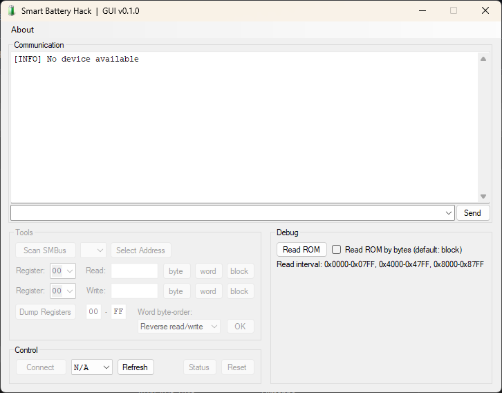
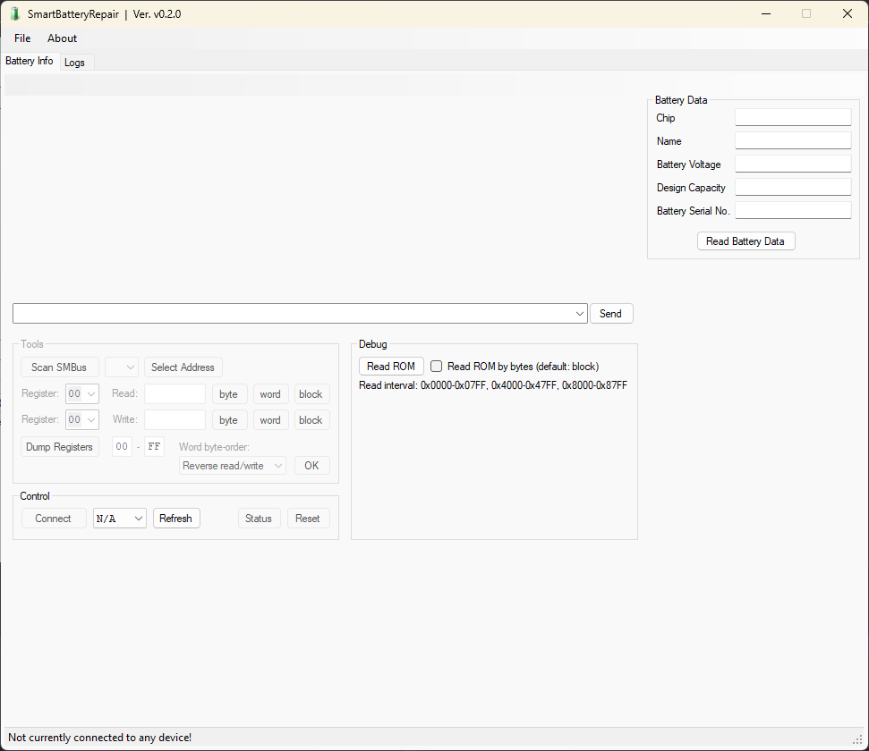

# SmartBatteryRepair

This software is based on the GitHub-repository: [SmartBatteryHack](https://github.com/laszlodaniel/SmartBatteryHack), but that was last updated in 2021.
That software will allow you to get the things you need, done, but it requires fairly technically involved knowledge og SMBus, registers, encryption and more.

My program will hopefully be a much simpler and user-friendly package, that you can use with a simple Arduino UNO, to repair your laptop battery (all without costing you an arm and a leg 😅).

As of this writing, Sept. 10th. 2025, the development is in the very earliest stage, and as this is something I do when (and if) time allows, it will take some weeks to get something properly usable.
___

## Important!

You'll notice that the original software was dubbed: Smart Battery Hack, but my version does not use the word "hack".  
There is a simple reason for this, though it would take a long time to explain. I am doing this because Mr. Louis Rossmann of Rossmann Repair Group made a VERY important statement in a video late Aug. '25 or early Sept. '25; **We are __NOT__ *hacking* our devices; We are simply __REPAIRING__ them, from a defective state, to a working state!**  

### Why is it important?
Simple; We do not support the manufacturers opinion of us *nefariously hacking* something, just because we're doing something they think we shouldn't! #RightToRepair is environmentally important legislation, and if the manufacturers made it simple (or even possible) for independent repair shops to get schematic diagrams, parts and tools, so we don't have to track down actually broken devices, that were smuggled out of a factory in China from a place that was supposed to destroy it, just to get that one component that is pre-programmed and unavailable to purchase by repair techs.

## Here I'll show the old layout vs. mine

> OLD:

> My new, tabbed, interface (earliest "sketch"):

___

More coming...