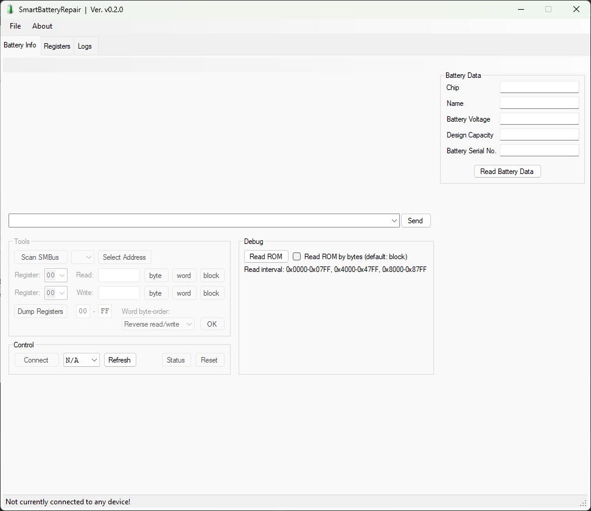

# SmartBatteryRepair

This software is based on the GitHub-repository: [SmartBatteryHack](https://github.com/laszlodaniel/SmartBatteryHack), but that was last updated in 2021.
That software will allow you to get the things you need, done, but it requires fairly technically involved knowledge og SMBus, registers, encryption and more.

My program will hopefully be a much simpler and user-friendly package, that you can use with a simple Arduino UNO, to repair your laptop battery (all without costing you an arm and a leg 😅).

As of this writing, Sept. 10th. 2025, the development is in the very earliest stage, and as this is something I do when (and if) time allows, it will take some weeks to get something properly usable.
___

## Here I'll show the old layout vs. mine

> OLD:

> My new, tabbed, interface (earliest "sketch"):

___

More coming...